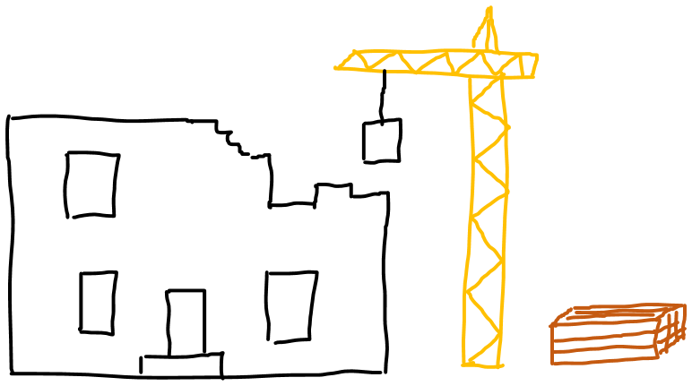

# Software engineering from 10.000ft
## Biological Approach to Software engineering

- unpredictable process
- complex, not just complicated
- process of developing software = scientific biology survey 
- uncertainty theory of software development: either know __when__ a software releases or __what__ it will do (never both)
- one cause of unpredictability: human factor ("Es menschelt") - no model can eliminate that, except for Cyberdyne Systems

- often-cited comparison: building architecture => not really good comparison
- instead of producing / building something: You never know what will be the result and when it will be there
- => "building" is so fast nowadays, a lot of programmers don't even notice it ("build"-step)

## Building blocks of software engineering

- programming languages
    - web-ish:
        - Java Script - family (everything ending with "JS")
    - OOP:
        - Java extremely interesting because of distribution, active community and evolution of the language itself
        - C#, C++
    - mobile
        - Swift
    - hardware
        - Assembler
        - C
- community, conferences, Hackatons, user groups, ...
    - Do yourself a favor and have a look at [hacktalk](hacktalk.de/) and [JUG Ostfalen](jug-ostfalen.de/)! 
- models
    - MVC
    - Domain Driven Design
- best practices
    - TDD
    - Clean Code
    - [SOLID](https://en.wikipedia.org/wiki/SOLID_(object-oriented_design)) = single responsibility principle + open/closed principle + Liskov Substitution Principle + Interface Segregation Principle + Dependency Inversion
- tools
    - IDEs
    - version control
    - building tools
    - analysis
- processes
    - waterfall
    - agile (Scrum, Kanban)
    - project management
- soft skills - Do yourself a favor and develop them!
    - technology = foundation of success in software engineering, but not enough
    - [The surprising thing Google learned about its employees](https://www.washingtonpost.com/amphtml/news/answer-sheet/wp/2017/12/20/the-surprising-thing-google-learned-about-its-employees-and-what-it-means-for-todays-students/?utm_term=.fa24e279994a)
    - 7 top characteristics of success:
        - being a good coach
        - communicating and listening well
        - possessing insights into others (including others different values and points of view)
        - having empathy toward and being supportive of one’s colleagues
        - being a good critical thinker and problem solver
        - and being able to make connections across complex ideas
    - best teams range of soft skills: 
        - equality
        - generosity
        - curiosity toward the ideas of your teammates
        - empathy
        - emotional intelligence
        - emotional safety

## Software engineering can be handled

- no silver bullet for problems
- over the decades a ton of methods, processes and models
- working, but dependent on circumstances
- because of relatively young branch emerging new concepts

## Opportunities

- because of all this: highly dynamic, omnipresent key-branch with huge opportunities
- favorite examples: 
    - Apple: "Let's sell the people the music they want to hear instead of hunting the leechers"
    - Tesla: "Let's think of a car as a moving computer!"
    - remote working movement
    - "thinking IT"