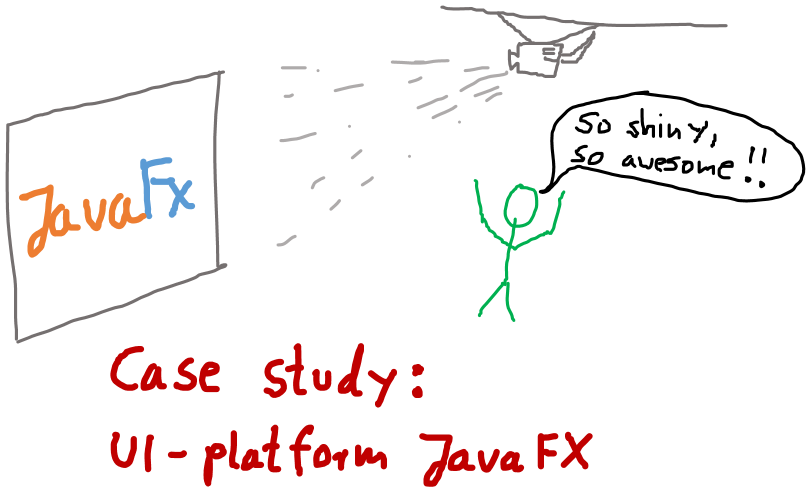

# Case Study: UI platform JavaFX

- goals:
    - learning basics of JavaFX
    - understanding Design of the platform and seeing design principles applied to a real-world-problem

## Chapter 1: Building your first FX application

- study / present chapter 1 from [JavaFX Workshop](https://github.com/stevenschwenke/JavaFXWorkshop)

## Applied principles

- ___Important note to Speaker:___ _principles not explained in detail yet. Students have to read up by themselves! This will be in the test._

- principle separation of concerns: Separation FXML, Java, CSS
- SceneGraph as a practical application of Trees
- composite pattern: components using the container-concept
- practical application of inheritance: everything is a Node, but not everything is a Parent
- peek in chapter 3, Architecture, for a real-world example of a system architecture
- Inversion of Control: 
    - Swing code generators: "protected regions". Changing these will cause the generator to fail to open this file.
    - JavaFX: 
        - platform uses annotations in controllers as hooks for events and for wiring everything together
        - possible to manually program node hierarchy AND have it "drawn" using SceneBuilder
    - Inversion of Control: "instead of being dependent on the generated code, the generated code becomes dependent on the handcrafted presenter"
    - also: Hollywood principle: "Don't call us, we call you!"

# Sources
- [Structuring complex JavaFX 8 applications for Productivity](8http://www.oracle.com/technetwork/articles/java/javafx-productivity-2345000.html)
- [JavaFX Architecture](https://docs.oracle.com/javafx/2/architecture/jfxpub-architecture.htm)