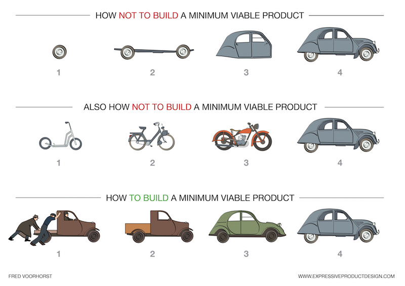

# Waterfall

- see __left side and center__ of [Waterfall vs Agile CheatSheet (by Development that pays)](http://www.developmentthatpays.com/cheatsheets)

- early days of creating software: no best practices, many different approaches
- formal approaches
- software development = engineering with models, methods, frameworks, ... 
- much bureaucracy and paperwork that slowed development down
- in cheat sheet: standard waterfall. However, V-model exists: specify tests for each phase during this phase
- missing in cheat sheet: maintenance phase
    - = "basically finished, but a lot of missing features"
    - = conceptually agile
    - in reality, there is no maintenance phase because development goes on 
- waterfall assumes 
    - customer knows exact requirements beforehand
    - assumes customers wishes don't change between start of project and release
    - assumes every last detail can be thought of beforehand, without starting to "think in implementation mode"
- HOWEVER: waterfall is not dead! 
    - certificated software: certification = requirements
    - software that definitively is not changed (deep-space probes)

# Agile
- "agile" = new word for old virtues
- result of development that took decades:
    - early 1990s: Rapid Application Development (RAD) = some formal methods + prototyping, evolutionary delivery, customer collaboration 
    - Scrum (1995)
    - Feature Driven Development (1999)
    - Pragmatic Programming (1999)
    - 2001: Agile manifesto

(Jurgen Appelo, https://www.flickr.com/photos/jurgenappelo/5201267505)
- empirical process control: transparency + inspect + adapt. Basically: "get knowledge from your experiences and adapt your actions"

- see __center and right side__ of [Waterfall vs Agile CheatSheet (by Development that pays)](http://www.developmentthatpays.com/cheatsheets)
- most-encountered real-world problem: waterfall-management cannot accept iterative process that simply cannot enforce a deadline.

# Scrum
- "Scrum" from Rugby
- perfect team size = 6 +- 3
- [scrum values](https://www.scrumalliance.org/why-scrum/core-scrum-values-roles), based on agile manifesto:
    - focus (on sprint goal)
    - courage
    - openness
    - commitment (don't promise something you know you cannot deliver)
    - respect
- the following image will be developed live:
 (source: [agile42](http://www.agile42.com/en/agile-info-center/scrum-cheat-sheet/agile.md))
- standard questions for retrospective:
    - What went well?
    - What do we want to improve?
    - What did we learn?
    - What is it that we don't understand yet? (Joseph Pelrine)
- implementation of "inspect" in Scrum:
    - Daily = inspect work of last 24 hours
    - Review = inspect work of last sprint
    - Retrospective = inspect processes, tools and behavior
- timeboxes (2 week sprint):
    - Planning: 4 hours
    - Daily: 15 minutes (0.25h x 10 = 2.5h per sprint)
    - Review: 2 hours
    - Retro: 2 hours
    - = 10.5h / sprint = <14% of time of sprint (without grooming meeting!)
- velocity
    - = amount of story points of finished user stories per sprint
    - in theory: good metric for planning
    - however, often source of arguments:
        - as always, no guarantee to finish promised stories
        - comparison between teams not possible (story of competitor who had two times the story points we had, hence loss of project)
        - often used metric for fixed price contracts, but very problematic      

# Minimum viable product
- Scrum and other agile methods build a Minimum Viable Product:

(image by [Fred Voorhorst](http://www.expressiveproductdesign.com/minimal-viable-product-mvp/))

# Scrum vs Kanban

- get full cheat sheet at [Development that pays](http://www.developmentthatpays.com/cheatsheets)
- have a look at those youtube videos:
    - [Scrum vs. Kanban: "You talk. We work."](https://youtu.be/9Jgu1BlTlSc)
    - [Scrum vs. Kanban II: Kanban Kaos](https://youtu.be/n2ZrUQNwrUk)
    - [Scrum vs. Kanban III: Kanban for the win!](https://youtu.be/sOlFPi5xJqQ)

# Sources
- [CheatSheets by Development that pays](http://www.developmentthatpays.com/cheatsheets)
- [Making sense of MVP](https://www.youtube.com/watch?v=0P7nCmln7PM&feature=youtu.be)
- [Minimal viable product?](http://www.expressiveproductdesign.com/minimal-viable-product-mvp/)
