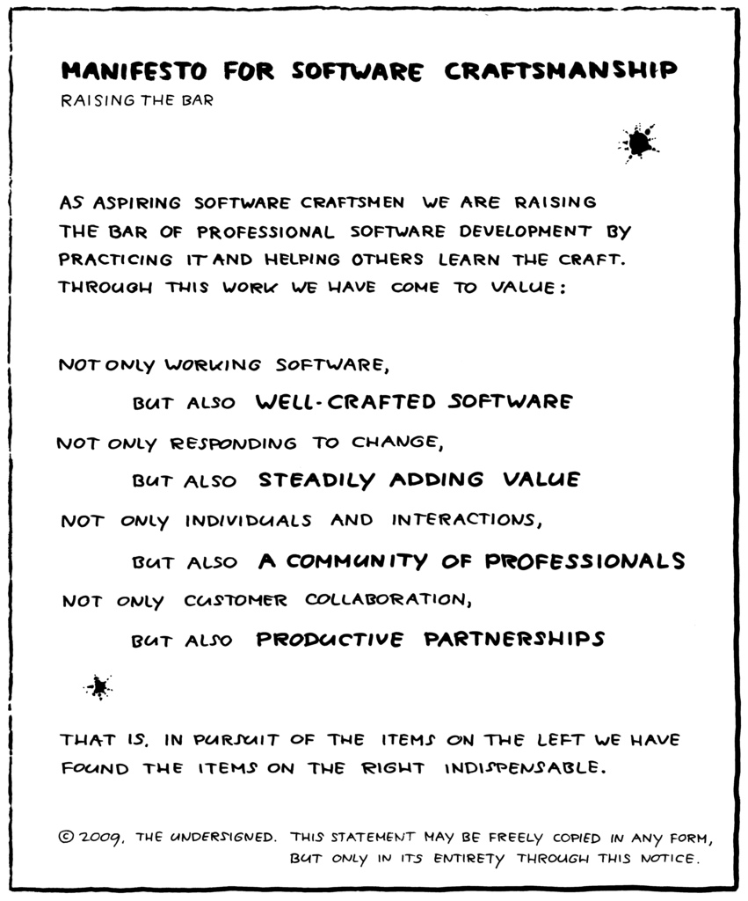

<!-- page_number: true -->
<!-- footer: "Management 3.0" by Jurgen Appelo -->

# Management 3.0
- Source: "Management 3.0" by Jurgen Appelo. Although many thoughts from the book are mentioned here, these notes are no replacement for the book. Go ahead and read it!
- one of the most-cited books about management (cited as a good book! ;) )
- chapters in slides same as in the book, however shorter
- book no hard academic background, philosophical and anthropological statements in slides not meant to be "exact" in the sense a philosopher / anthropologist would consider "exact"

---

__What does that have to do with software engineering?__
- knowing how teams work important for every team member
- possible step for you: management (begins at technical team lead, very early)
- "soft"skills = most impact on environment, much higher than technical skills
- plain interesting to use mechanics and methods of engineering to social context :)

---

## Preface

--- 

### Management 1.0
- Hierarchies
- Command and Control
- top-down management
- source of bonus and incentive systems

---

### Management 2.0
- "addons" for Management 1.0
- Balanced Scorecard, Six Sigma, Theory of Constraints, Total Quality Management
- top-down management
- rapidly changing and new addons

---

### Management 3.0
- 21th century = "century of complexity" (Stephan Hawking)
- Management 3.0 = complexity
- organizations = networks
- management = about people and their relationships, not departments and profits
- organizations = living systems

---

## Chapter 1 - Why things are not simple
- agile software development = best way to develop software, but old-style management = biggest obstacle
- agile managers have to learn how social systems work because they manage people

---

- humans prefer causality: "If this, then that" because brains made for it
- causality works great for small problems
- but: causality not enough for complex world

---

- complexity != large numbers. Small problems can be complex, too: water = system out of things out of only three atoms, however very complex
- needed: strategies to deal with complex problems

---

## Chapter 2 - Agile Software Development
### The way to agile
- "agile" = new word for old virtues
- result of development that took decades
- early days of creating software: no best practices, many different approaches
- formal approaches: software development = engineering with models, methods, frameworks, ... => much bureaucracy and paperwork that slowed development down
- early 1990s: Rapid Application Development (RAD) = some formal methods + prototyping, evolutionary delivery, customer collaboration => Scrum (1995), Feature Driven Development (1999), Pragmatic Programming (1999)
- 2001: Agile manifesto

---

(Jurgen Appelo, https://www.flickr.com/photos/jurgenappelo/5201267505)

---

### Other systems
- Lean Software development, derived from 14 principles of Toyota way + 14 points for Management by W. Edwards Deming = focus on removing waste and optimizing the whole
- Capability Maturity Model Integration (CMMI) = huge framework that can be applied to other systems, not just software
- others: Guide to Project Management Body of Knowledge (PMBOK), PRINCE2, Unified Process, Rational Unified Process (RUP)

---

(Jurgen Appelo, https://www.flickr.com/photos/jurgenappelo/5201268767)

---

### Main question: What is the role of management in an agile world?

---

- project management
    - identify project: stakeholder, what to get done, when to get it done
    - gantt-Charts
    - fine-grained task planning
- line management
    - orthogonal to project management
    - often personal development (together with project management, but also on a broader scope)
- leadership
    - often done by upper management or shareholder
- (from [distilled.net](https://www.distilled.net/blog/distilled/the-difference-between-planning-project-management-line-management-and-leadership/))
---

## Chapter 4 - The Information-Innovation System
- Innovation is bottom-up and can not be organized top to bottom by management
- top-down approach = linear thinking, trying to control the future => doomed to fail

---

### 5 ingredients of innovation
- innovation = emergent result, cannot be planned

---

#### Ingredient 1: Knowledge
- performance != level of expertise
- performance == connectivity between people

---

#### Ingredient 2: Creativity
- Graham Wallas and Richard Smith, 1926 "The Art of Thought"
1. Preparation: Really getting to know problem
1. Incubation: consciously and  unconsciously working the problem (going for a walk, postponing work to the next day)
1. Intimation: realizing new ways to solve the problem that didn't occur before
1. Illumination: Finding the solution that fits best
1. Verification: Applying solution, improving it

---

#### Ingredient 3: Motivation
- goal of management: motivate and energize people
- "The one-Minute Manager" by Kenneth H. Blanchard: "People who feel good about themselves produce good results."
- my projects = "We make the cool stuff that rocks!"

---

#### Ingredient 4: Diversity
- diverse teams outperform homogeneous teams

---

#### Ingredient 5: Personality
- no simple answer here
- a lot of values in lists like the Agile Manifesto
- values have to be shared by all team members
- values are dynamic and will change

---

## Chapter 5 - How to energize people
### Creativity
- preconventional: < 7 year olds. Spontaneity, emotional involvement
- conventional: 7 - 11 year olds. Thinking, dominated by constraints and conventions
- postconventional: > 11 year olds. Producing new things DESPITE knowing constraints
 
---
 
- to break the rules, you have to know them
- "beginners mind" = freedom of a child's ignorance despite own knowledge

---

### Principles of Creativity
1. __Safety__: failure OK, not afraid to ask questions and express ideas
1. __Play__: turn activities into games, play in lunch break
1. __Variation__: meetings in park, name product releases
1. __Visibility__: making results of creativity visible (Googles offices)
1. __Edge__: getting out of comfort zone. Workout has to "hurt a little" to be effective

---

### Creative techniques
- quote from professor of mine: "There is no brainstorming!"
- see wide field of idea engineering

---

### Extrinsic motivation
- = financial benefits, non-monetary rewards, praise
- destroys intrinsic motivation!
- lots of side effects: only working for extrinsic benefits, reduced performance, competition between colleagues
- not necessarily bad thing - but beware the danger!

---

### Intrinsic motivation
- removing demotivating factors doesn't automatically create motivating factors
- motivating factors are needed at work

---

### Ten desires of team members
1. feeling competent
1. feeling accepted
1. curiosity is addressed
1. honor satisfied
1. idealism, purpose
1. independence, autonomy
1. certain level of order in organization
1. power and influence over what's happening
1. environment for social contracts
1. creating status for themselves in the organization

---

"What can I do to help you do the best work?"

--- 

### Motivational balance sheet
  

(https://www.flickr.com/photos/jurgenappelo/5201842470)

---

### Values
- corporate values != team values
- sometimes identical, but only sometimes
- teams form own value systems

---

## Chapter 6 - The basics of self-organization
- misconception: "Systems have to get organized"
- self-organization is the norm!
- command-and-control invented by humans, not natural
- problem with self-organization: resulting systems don't match value systems of share holders

---

- good managers decide as few as possible and let subsystems decide
- subsystems only able to do so if empowered
- empowering people improves manageability
=> teams and companies are not built, they are grown

---

## Chapter 7 - How to empower teams
- being bossy => motivational dept
- people want to be asked to do something, not told => only then give commitment
- not easy!
- may make short-term problems harder to solve, but long-term problems easier

---

### A Wizard's heat
- wizard = dude who enables heroes to succeed (doesn't do the work himself)
- => manager should be enabler for teams
- Micromanagement prevents workers from being able to self-manage

---

### Empowerment
- = manageability
- manager should make himself dispensable (see reference to Scrum Masters)

---

### 7 Levels of authority
1. __Tell__: Decision by manager, announced to team
1. __Sell__: Decision by manager, selling to team to get commitment
1. __Consult__: Manager asks input from team before deciding
1. __Agree__: Decision by team, manager equal to others
1. __Advice__: Decision by team, manager tells his opinion
1. __Inquire__: Decision by team, manager can be convinced afterwards
1. __Delegate__: Decision and whole process by team only

---

### Being a good manager
- own behavior = "predictably pleasant"
- leading by example (story: making grimace during daily because of misunderstood failure)
- "You can only trust others if you trust yourself first" (get yourself in order, write mission statements, keep a diary, have a social life, ...)
- asking for feedback gains respect

---

## Chapter 8 - Leading and ruling on purpose
- rules always change in living systems
- job of manager: making sure people can create their own rules (not creating the rules for them!)
- self-organization not enough: "light-touch leadership" or "alignment of constraints" to steer organization in a direction that benefits all in the system

---

### Three responsibilities for a manager
1. developing the system
1. protecting the system
1. directing the system

---

### Emergent leadership
- presentation "Step Back from Chaos" by Jonathan Whitty
- managers often not the hubs in a groups social network
- emerging leaders = most communication

---

### Purpose
- people hardwired to care about purposes
- need for "going somewhere"
- vision from leaders = one of strongest needs of humans
- organization = system of various stakeholders with own goals
- => stakeholder value != values of organization!
- german "Dienstleistermentalitaet" = "where the customer leads, we follow"
 
---

## Chapter 9 - How to align constraints
- goals = express directive + improve morale
- unite and motivate people in a team by giving purpose through goals

---

### Management by objectives (MBO)
- = management defines shared goal across a group
- often implemented as: top management defines annual "shared" goal, hands out bonuses
- NOT AGILE, not motivating, not right for people in smaller context like teams

---

### "Good" shared goals
- has to transcend goals of everyone involved, including CEO
- "higher purpose"
- NOT goal of the customer, project manager, ...

---

### Mission Statements
"SpaceX was founded under the belief that a future where humanity is out exploring the stars is fundamentally more exciting than one where we are not. Today SpaceX is actively developing the technologies to make this possible, with the ultimate goal of enabling human life on Mars."

---

### Mission Statements
"Tesla's mission is to accelerate the world's transition to sustainable energy"

---

### Mission Statements
"Google's mission is to organize the world's information and make it universally accessible and useful"

---

### Agile goals
- Wait - what? These are not S.M.A.R.T. goals!
- agile goal setting differs from classical goal setting:
1. higher purpose, transcends goals of individuals
1. not required to have criteria like S.M.A.R.T. (but may have!)
1. not connected to rewards or incentives (defeat purpose of goal itself)
1. allowed to change when necessary ([Tesla](http://www.sciencealert.com/tesla-just-updated-its-mission-statement))
1. created to give a sense of direction, not please stakeholders

---

### Bringing goals into heads
- goals often written on paper, cups, posters
- not forbidden, but inadequate
- goals have to get into heads!
- people must FEEL them in everything they do
- => talking with everyone in organization, asking questions
- "How is this action going to help us in achieving our goal?"
- "It is a goal when people can recite it"

---

### Teams can (!) have their own goals
- if team has other goal, let them have it
- never make them choose one (against self-organization)

---

## Chapter 10 - The Craft of Rulemaking
- "When situation X occurs, people must do Y" => linear thinking, no freedom
- managers "program" team members
- better: let team decide, only set constraints

---

- agile software development = set of constraints + freedom for team
- "collaborate with the customer"
- "allow frequent changes"
- team may program itself in special situations: "IF snowstorm makes traveling difficult, THEN daily is done via Skype"

--- 

### Agile Blind Spot
- Jurgen Appelo
- Agile development only good with smart, motivated people
- freedom of Agile has to be used wisely

--- 

### Craftsmanship is important!
- Brian Marick, "Six years later: What the Agile Manifesto left out"
- skill and discipline never mentioned explicitly in manifesto
- many people think Agile is undisciplined - on the contrary!
- Stevens opinion: self-discipline and diligence will cary a long, long way

---

### Discipline * Skill = Competence
- discipline: pilot's checklist have to be done again when radio message interrupts

---

### Boomerang effect of people not following procedures
Gerald Weinberg
1. skip part of quality assurance
1. problems in shipped product
1. problems reported by customers
1. emergency interruptions
1. time pressure on dev team
1. skip more procedures

---

__Skipping discipline makes you slower, not faster!__

---

Technical Term: "Technical Dept"

--- 

### People can make rules on their own!
subsidiarity principle = handling problems at the smallest competent authority

---

applied to software development teams:
implement agile processes according to specific problem and situation

---

## Chapter 11 - How to develop competence

Competence = Discipline * Skill

---

### Sub-optimization principle
If each subsystem, regarded separately, is made to operate with maximum efficiency, the system as a whole will not operate with utmost efficiency.

---

=> optimize the whole, not its parts!

- "what gets measured, gets managed"

=> Measure the whole to optimize the whole. Use global metrics.

---

HOWEVER:

Don't __only__ measure / manage the whole!

---

### Metrics for projects
1. __Functionality__: Story points completed (velocity)
1. __Quality__: Problems reported by testers
1. __Tools__: Costs per month
1. __People__: Impediments reported by team members
1. __Time__: Days remaining until live release
1. __Process__: Checklists completed
1. __Value__: Increase in usage in users per minute

---

#### skill != discipline
- should be measured separately from each other
- skilled people should also be disciplined and not be lazy because they are skilled
- disciplined people should develop skill
- discipline: task-board up to date, meetings timeboxed
- skill: quality of delivered product, satisfied customer

---

#### Favor proactivity over knowledge or experience
- measure what people __make__ of their knowledge and experience
- don't value knowledge and experience themselves

---

#### Rate relatively, not absolutely
- bad: "Team A finished 11 story points, team B only 5"
- good: "You did 10% better than the last time"

---

#### Short feedback cycles
Yearly employee feedback talk  

vs 

mail from CI server in case of compilation error

---

### self-discipline
- most important rule for leader: lead by example:
    - be professional
    - be on time
    - be proactive
    - be positive
- if you want to become a self-disciplined leader: Just be one. Think about what he would do, and then do it. 

---

## Chapter 13 - How to grow structure

---
### "Team members in Scrum"
- Scrum: "team of team members" means "everybody is supposed to be great at any job"?
- I don't know one single team which works that way.
- specialization since industrialization a great idea!

---

- real meaning: "everybody is responsible for the result of the whole team"
- => Role titles and designations useless! Work should be done by whoever is best qualified.
- pragmatic approach: hire T-shaped people (few specialized topics, lots of known topics)
- side story: "have experience with every technology buzzword" in Romania
- __Think about it: What does that mean for _your_ career?__

---

### Informal Leadership
- = concept described above
- should be supported because exists anyway (since forever and forever)
- problems with formal assigned roles: have to be kept busy, not scalable ("Web Designer is at 100% - we need another one -> 6 month later have to fire somebody because of lack of work)
- informal leadership contributes to adaptability and scalability

---

### Structure of teams
- every team member in exactly ONE team, not more
- temporary assisting another team OK
- teams should be kept together as long as possible
- team size "7 plus minus 2"

---

### Scaling teams
- different views about how to scale with multiple teams
- generally good: "each team little value unit"
- option 1: cross-functional teams: every team should be able to produce working product because every specialization / knowledge exists in team
- option 2: function teams: teams of specialists
- solution depends on a lot of things

---

## Chaper 14 - The Landscape of Change

---

__Change is the only constant__

-- <cite>Heraclitus</cite>

__"Embrace change"__
 
-- <cite>subtitle of "Extreme Programming" from Kent Beck</cite>

---

systems have to be changed continuously to keep being effective

__+__

change increase complexity unless someone prevents that actively

---

However: Software systems will fail eventually.

Success = postponing  failure as long as possible

---

Having success for at least a while through
 1. adaption
 1. exploration
 1. anticipation

---

### Careful with anticipation! 

Idea: anticipate what will kill your system and prevent it.

"Anticipation is like alcohol. It is healthy when used in a small dose. But it is addictive, and most people use far too much of it."

=> Story of architect in one of my projects: "Do we really know we are going to need this?"

---

- agile development doesn't reject anticipation, but tries to reduce it
- good tool in small doses

---
### Homeostasis
= stability
= system keeps doing what it has been doing in the past, regardless of changing forces

reason: attractor holds system in current state

---

- change is possible:
    - attractor depends on environment
    - change in environment forces attractor to react

---

- don't try pushing teams and organizations out of current behavior
- change surroundings instead

---

- Example:
    - former project old technology, Ant-scripted build
    => Nobody wanted CI and "modern" build & deploy
    - new project: existing, already running CI infrastructure
    => using it was the new default
    
---

## Chapter 15 - How to improve everything
- following strategies work not only for software development teams

---
### Definitions of Improvement

- kaikaku = radical improvement
- kaizen = continuous improvement (adaption + anticipation + exploration)

---

### Building blocks of Improving things

---

#### Know your position
- first step of every improvement: know current situation
- problems, impediments, wishes, individual goals of teammates
- in military and self-defense = "situational awareness"

---

#### Moving in a better position
- by small steps like introducing daily communication, improving discipline, creating coding guidelines
- will show team that change is possible
- can be used to prepare for bigger leaps

---

#### Radical Jump ("Kaikadu")
- huge change in organization or process
- example: begin working "Scrum by the book"
- no need to hit perfect position after jump, just "close enough"
- can bring decreased performance, only temporary

---

#### Step-by-step improvement (Kaizen)
- often after radical jump
- number of incremental, small changes towards a common goal

---

#### Be vigilant
- similar to "know your position" / situational awareness
- new, optimized position will not be the optimum forever
- keep an eye for changing environments and begin improvement process

---

### Change is the norm
"We just changed that process three months ago"

vs

change is the norm, omnipresent, necessary, beneficial, standing still = exception

---

Goal: Create environment in which people understand change as chance, not threat.

---

Change can be supported by
- flexible office layout with movable desks so teams can form spontaneously
- infrastructure that enables working from anywhere (remote working)
- scalable technical environment (licences, ordering process of new hardware, employees trained beyond borders of current project to be transferable in new projects)
- and many more ...

--- 

### How to communicate change
- communication = key factor (like always ...)

---

Don't
- use the word "reorganization" because that is the opposite of the known "organization" 
- name initiatives like something special like "The big Scrum initiative"
- make people think change has a beginning and an end
- use "Tiger teams"

---

Do
- use different opinions in organization to find optimum
- mix working processes and methods from great-performing teams in other teams
- use ideas already out there - copying existing stuff is way cheaper then inventing new stuff