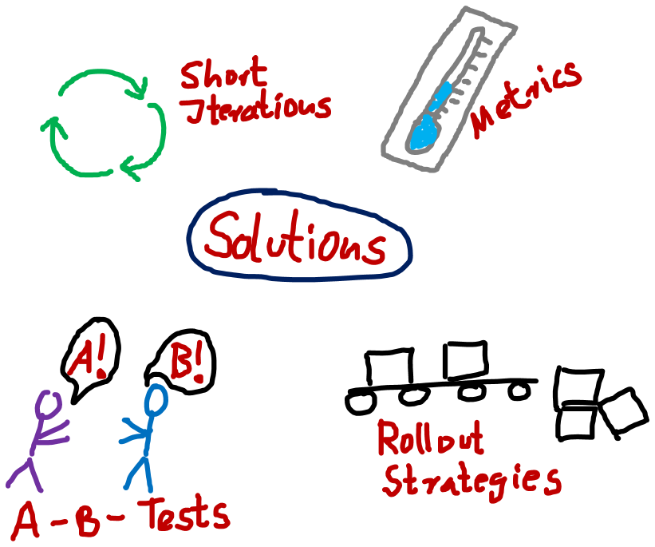
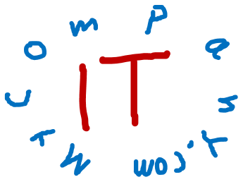

= Digitization
:toc:
:toclevels: 1
:sectnums:
:imagesdir: images

= Digitization

image::wayToDigitization.png[]

* history: batch-systems -> online systems -> Client-Server -> Web-Systems -> mobile applications
* however: experiences and knowledge not sufficient for future => situation nothing new, nothing special - IT has to learn like everything else
* no global definition
* Uwe Friedrichsen: "Digitization means that IT is an integral part of business products and services."

* = "IT is business and business is IT"

== New expectations enforce new solutions
=== Expectations

image::expectations.png[]
* User Experience
** in-house applications have to be sexy, too!
** applications visible to the "outside world" of course too!
* Performance
** often expected: less than a second!
** customer doesn't care about backend workload
* Multi-Device
** mobile first = expectation
** for example Smart TV, Connected Car, SmartWatches
* Availability
** zero downtime
* Scalability
** technically not important to the user
** however: performance expectations lead to scalability
* Security
** distributed systems != "just this one server"
*  Uncertainty
** because of rise of IT and IT-services, customers expectations not certain
** possible that long-planned, long-developed, expensive solutions neglected by customers => one solution: Agility.

=== Solutions

* Short Iterations
** Agility
** fast feedback
** trial balloon
* Metrics
** gather feedback
** not just from users directly, but also using feedback systems (usage of features etc.)
* A-B-Tests
** compare two solutions with each other
* Rollout Strategies
** blue-green-deployment not flexible enough
** https://martinfowler.com/bliki/CanaryRelease.html[Canary Releases] (rolling out new features to some users, only after testing to all users) to chosen, "friendly" key users

=== Conclusion
image::noSilverBullet.png[]
* no silver bullet
* simply doing what has been done before will not solve these problems
* completely new concepts, architectures and approaches needed
* good news: most of the technology already exists, but has to be used in conjunction with each other

== Most important factor: speed
image::speed.png[]
* no more customer loyalty, user experience most important
* case study: Kodak
** founded 1892
** 1991 DC-100 first digital camera, 25.000 DM way to expensive
**digital photography = future
** despite first digital camera: loss of money, insolvent
* case study: Nokia
** 1998 - 2011 worlds biggest manufacturer of mobile phones
** 2007 Iphone
** 2014 bought by Microsoft
* conclusion: Speed matters most!
* quickly available product beats perfect, late product
* case study: German automotive industry 2018
** Volkswagen: "2030 every car in e-version"; Matthias Müller, Volkswagen: "Tesla = master of announcements" ("Ankündigungsweltmeister"), destroys money and fires employees
** Tesla: 3 different models, more sells of Model S than Daimler's class S, more range, autonomous driving
** experience, gathered data, internal infrastructure, customer feedback: some say "outperformed"
* different culture needed - that's why labs and startups are founded by big companies: no sluggish processes, new young employees, freedom
* cross-functional teams important to deliver fast
* soft skills absolutely needed by every developer!

== IT = core of every company

* requirement: IT as consultant for core business (generating ideas, developing infrastructure and corporate architectures)
* structure of companies have to change to move IT into every aspect of the business
* examples for companies without real product, just IT:
** Uber
** Airbnb
* new: accessibility to IT: what once was only available to huge companies can now be used cheaply (Amazon Web Services for example)
* offerings have to be individually customisable, available in real-time, networked and integrated (compare Otto / Quelle vs Amazon)
* software updates = new functionality, even without hardware change (Tesla)
* new value streams via IT = IT directly responsible for cashflow. Example: Caterpillar network construction machines to optimize waypoints and routes + machine learning to be notified if a combination of sensor readings occurs that damaged other machines in the past: "This machine will break in 2 days and will need repair in subsystem x with exchange parts y and z."

== Rapid Prototyping & MVP
image::MVP_v2.jpg[]
(image by http://www.expressiveproductdesign.com/minimal-viable-product-mvp/[Fred Voorhorst])

* new strategy: probe -> sense -> respond
* one example for this new strategy: Prototyping = develop test version of a product to gain insight, not to deliver finished product
* reduce complexity of product to absolute minimum
* create test version FAST
* MVP
** = minimal viable product
** = drastically reduced versions of final product, but usable (Tesla Roadster, first IPhone)
** Scrum and other agile methods build a Minimum Viable Product:
** "that version of a new product which allows a team to collect the maximum amount of validated learning about customers with the least effort"
* important to have fast and direct feedback from actual customers (feedback-loop)
* learning fast = only way to win
* good rapid prototyping teams
** are stable (to avoid storming-phase)
** have great tools (to be as fast as possible)
** are autonomous (don't wait for input of other teams or persons, have control over tools and processes)
** lean processes

= Sources
* Softwerker Special "Digitalisierung" (Codecentric):
** Uwe Friedrichsen, "Digitalisierungslösungen sind anders"
** Iva-Alexander Jung, "Geschwindigkeit ist der entscheidende Wettbewerbsfaktor"
** Nils Woloka, "Probe, Sense, Respond"
* https://www.heise.de/newsticker/meldung/VW-Chef-kritisiert-Tesla-Vernichtet-Geld-und-schmeisst-Mitarbeiter-raus-3866221.html[VW boss criticises Tesla: "destroys money and fires employees"]
* http://www.baublatt.de/startseite/2016/07/22/digitale-trends/[Baublatt, digitale Trends]
