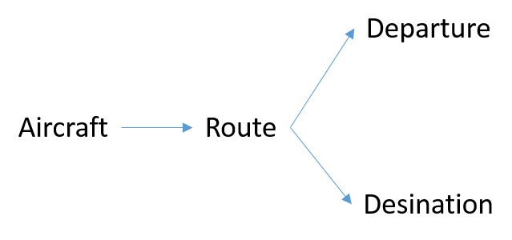
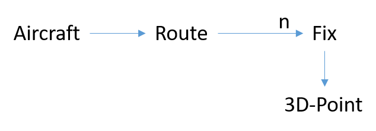
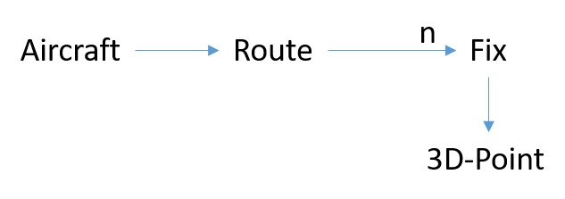
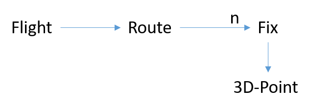
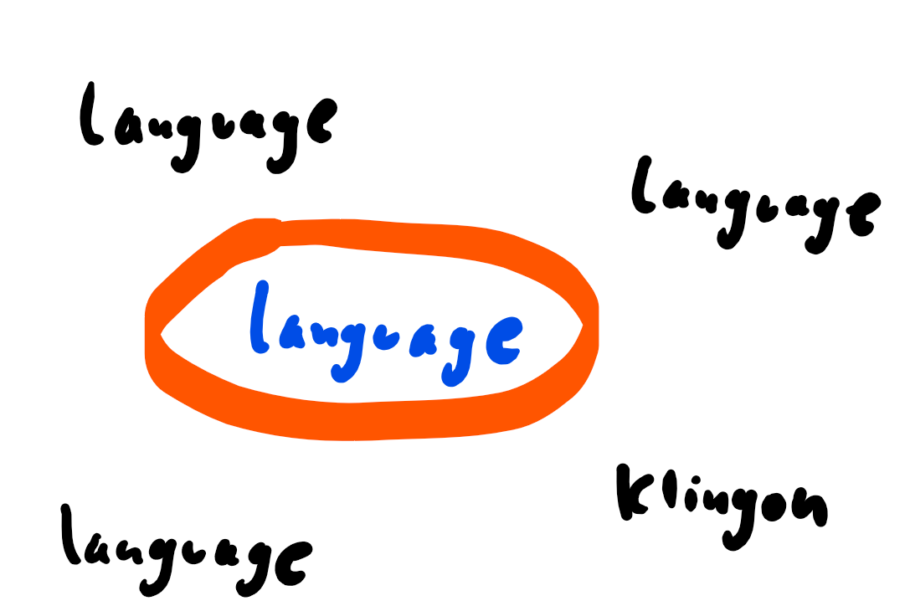
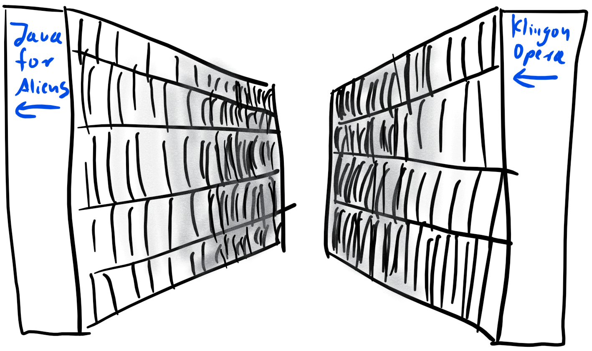

# Domain Driven Development
This chapter is heavily influenced by [Domain Driven Design Quickly, InfoQ](https://www.infoq.com/minibooks/domain-driven-design-quickly).

  

- software = solution for business problems, not end in itself
- goals of DDD: keep gap between business logic and technology as small as possible + domain logic has to be isolated from other code (like infrastructure)
- real-world-problem that software solves = "Domain"
- to solve problems in a specific domain, software engineer has to understand this domain well! (No "Just give me the formulas and a GUI mockup and I'll code it for you")
- to attain this knowledge: talk with THE specialists: your customer
- to understand the specialists: Learn their language, learn their thinking. Really gasp their problems!
- Goal: Software = reflection of domain
- test: Can someone without any domain knowledge learn something simply by reading your code? (Answer should be "yes")
- DDD defines a set of concepts like Entity, Value Object, Repository or Aggregate. Every (!) class in the code has to have a "is a" relationship to one of those concepts.
- That means: Every class has to implement the concepts in detail.
- DDD = design + development practice
- DDD = technology-agnostic
- another trend is to add annotations directly into domain classes, for example annotations for persisting entities with JPA. These have to have a default-Constructor, which is also wrong in DDD. Solution: Lombok-Builder. However, that complicates the code even more.


## Domain Model
- = internal representation of target domain. Model is in our heads. It's what we understand of the domain.
- has to be communicated to others (domain experts to verify understanding, fellow developers, ...)
- can have many forms (diagrams, text, pictures)
- because of complex domains, often the model doesn't take every single aspect into account and is not completely correct. That's why it's a model. (= requirements engineering, very challenging!)

## Building Domain Knowledge
- example: flight monitoring system: tracks every flight over a certain area, checks if route is right and checks for collisions
- building knowledge via communication with air controllers
- first result: aircraft has a departure and destination airfield

  
- while in the air, aircraft follows a route. More natural to model this new knowledge like this:

  
- route is made of smaller segments that each connect two fix points. Hence, departure and destination are just two normal fix points

  
- further talking to air controller: Fix is not a 3-dimensional point, more points on Earths surface. Hence:

  
- more abstraction: aircraft itself is not that interesting. It's more abstract a flight that we model:

  
 
## Ubiquitous Language

  

- problem: software engineers think in software artifacts like classes, methods, packages, inheritance, OOP. That is good! However, domain experts think in their "world".
- explaining via simplified examples
- time-consuming process, often skipped or cut short. Error! Very important!
- "naming is hard": take your time to find the right words for concepts
- solution: Common language based on the domain model.
- using language based on domain model consitently throughout the code, in discussions, documentations, everywhere!
- designations will change during development. Replace old words with new ones everywhere, so the language keeps being consistent. Take your time to refactor the codebase.
- one huge problem of the model that consists of the ubiquitous language: Grows very large soon. When mapped in UML, a lot of boxes with arrows that fills a whole wall. Solution: Just document one aspect of the whole system via a subset of the UML components.

## Model-Driven Design (MDD)

  

- problem: domain model reflects domain problem, but not concepts important for coding (like design principles or issues with the chosen programming language). Hence: developers come up with their own model, hence gap between domain and code widens
- one approach to prevent his: analysis model: separate from code design and done by different people, no consideration of programming language. Result of business domain analysis. Goal: understand the domain. Analysis model is a temporary image of the domain knowledge, developed by domain analysts for software developers. Those try to get an understanding about the domain and regard the analysis model to replace it with a better one. Maybe refactoring of analysis model, maybe replace it with a new one. Also problem with this approach: analysists meet with domain experts and create analyst model which is given to the developers; documents are a gap between the domain experts and the developers. Better approach: developers talk directly with domain experts, without analyst model.
- better approach: domain modeling and design close together: create model with consideration of design issues, developers participate in construction of model
- hence: model and code very close together
- important: change to the code = change to the model! Hence, no refactoring without tinking about domain. But also: No changes in model without consultant developers!
- object oriented languages very suited for MDD. Procedual languages not that much.

## Building blocks of model driven design
### Layered Architecture

TODO Bild 4-Schicht-Architektur

- often, domain part of software very small compared to the rest of the code that is just infrastructure
- common architecture: layers: every layer depends only on the layers below
- everything having something to do with domain model in one layer, isolated from user interface, persistance or infrastructure. Hence: domain objects' only task is to express the domain model.
- common architectural solution for domain-driven designs 4 conceptual layers:
1. Presentation Layer: Presentation of information and processing of user commands
1. Application Layer: technical (not business!) layer for transportation or technical issues, for example provides services that can be called. NOT for state of domain model or business logic. 
1. Domain Layer
1. Infrastructure Layer: communication between layers, persistence, provides libraries

### Entities

  

- have an identity that remains the same throughout the states of the software
- OOP languages reference objects in memory. Those objects change constantly
- OOP objects are NOT DDD entities!
- example: modelling "person using a software": "Person" would be a class with attributes like name, date of birth, place of birth etc. Name cannot be identity because multiple persons with the same name exist. Same for birthday and place of birth. Objects must be identifiable even with the same attributes!
- several ways of creating entity in software:
1. one attribute
1. multiple attributes in combination
1. attribute specially created to provide identity
- ways of creating a unique ID for each object:
1. ID automatically created internally and only used internally (not shown to user) Example: database ID.
- not every object should be an entity for example because of performance issues: for every entity, there has to be one object instance. When dealing with thousands of client-objects simultaniously and client is an entity, there have to be thousands of objects around.
- entity should have continuity, being part of a lifecycle.
- JPA-entity is not necessarily a DDD-entity! Example: JPA-entity needs a default constructor, whereas that is forbidden in DDD-entity. 
- there must not be a repository for every entity. Example: "big" entity consists of several other entities, makes no sense to have small repositories for small enttities


### Value Objects

  

- = describe aspects of a domain but doesn't have an entity
- examples: 2-dimensional points in a drawing application
- without entity, value objects can be easily created and discarded (because entities have a meaning in domain logic, value objects don't)
- highly recommended that value objects are immutable
- when they are, they can be shared between modules or even systems => less problems when objects don't change
- value objects should be simple
- when immutable, creating copies very easy
- can contain other value objects
- can also contain references to entites
- when value object is mapping for entity, it should only hold those attributes of interest for the current task. Often a subset of all attributes of entity. 
- Attributes should form a "conceptual whole". Example: Person should not have attribute city, street, number. Should have a reference to value object "address" that encapsulates these because they belong to each other conceptually. 
- another use of "conceptual whole": Avoid "stringly typed code" = strings that should be real classes:
   ```java
    private String firstname, lastname, email;
    ```
- every class that gets the email as a string has to validate this string
- better: class EMail validates at construction, hence there are only valid mail addresses
- more abstract: concept of the domain only implicit in the code, not explicit
- plus: because of separation of things, it's much more easy to write tests
- opposite of stringly typed code: Strongly typed code:
   ```java
    private FirstName firstName;
    private LastName lastname;
    private Email email;
    ```
- value objects can be JPA-Entities, but no DDD-Entities

### Services

  

- TODO Bild passt nicht. Entities sind schlau und machen Dinge. Service spannt nur Logik über mehrere Entities, weil die Logik in diesen Entities nicht gut aufgehoben wäre.
- cover actions that do not belong to any object and therefore should not written in an entity. Or action does belong to multiple objects and therefore it's not clear in which one it will end up. If those operations would be added to entites, this would bind those entities and the other ones highly to each other. "loose coupling, high cohesion"!
- according to object orientation, those functions have to belong to an object anyways: A Service.
- no internal state
- provides functionality to the domain
- "Services act as interfaces which provide operations"
- common in technical layer, but can be used in domain layer, too!
- 3 characteristics of a service:
1. operation performed by Service refers to a domain concept which does not naturally belong to an Entity or Value
Object
2. operation performed refers to other objects in the domain
3. operation is stateless
- important: operation name in services have to be part of the ubiquitous language!
- important: isolate domain layer from other layers such as infrastructure layer (one Service should either provide domain operations or infrastructure, never both!)

### Modules
- when domain model grows larger, clustering is a good idea
- modules = part of domain model
- "high cohesion, loose coupling"
- should have well-defined interfaces to communicate with other modules
- in Java: don't just call an object from another module. Use an interface to operate on those objects.
- as with the service methods: names have to be part of ubiquitous language!

### Aggregates
- aggregate = domain pattern to define object ownership and boundaries
- aggregates = collection of other objects (= entities or value objects)
- don't have a life cycle
- goal of modelling: keep it as simple as possible. Hence, number of associations should be as low as possible.
- example: one-to-many relationship is more complicated than one-to-one. Hence, class-to-aggregate is easier to understand than class-to-many-classes
- often, bidirectional associations can be transformed to unidirectional ones (example: car and engine tied together. However, "car has an engine" and not the other way around often sufficient)
- objects in an aggregate are considered as one unit when it comes to data changes = get all persisted together
- each aggregate has one root, which is an entity
- root is the only object accessible from outside, in other words: objects not included in aggregate must not reference objects in aggregate except for the root
- root can hold references to any objects in the aggregate
- objects in aggregate can reference each other
- root is responsible for triggering data changes in the objects of the aggregate
- if root deleted from memory, all the objects in aggregate will be deleted, too
- "allowed" to pass copies of inner objects to objects outside the aggregate, because that won't change objects in the aggregate
- if objects stored in database, only root should be accessible via queries. "Inner" objects only through traversing aggregate.
- inner objects should be allowed to hold references to other aggregates roots
- inner objects only need local identity, not global identity
- example: Customer (customerID, name) is root for ContactInfo (honePhoneNumber, workPhoneNumber, faxNumber, emailAddress) and Address (street, city, state)

### Factories
  

- already mentioned by Design Patterns by Erich Gamma et all
- domain pattern to create objects
- to create complex entities and aggregates 
- support thinking of DDD: a car doesn't create itself, it gets created in a factory.
- factories wrap creation process much better than calling a constructor and then a number of setter. Often, these have to be constructed with certain knowledge, for example setter called in a specific order. This intern knowledge has to be encapsulated => factory 
- perfect to create aggregates
- enforce creation process to be atomic
- if creation cannot be successful, throw exception to avoid having a "half-created" object
- variant: factory method in an aggregate. That way, no additional class is necessary. Created objects automatically put into aggregate.
- whenever object changes, make sure to change the factory accordingly
- perfect for creation of aggregates because internal rules of aggregate can be implemented in factory that creates this aggregate 

### Repositories

  

- in DDD, objects have a lifecycle from creation to deletion / archiving
- when object needs to be used, get it out of database and use it. => negative impacts on design: database is part of infrastructure. Hence, detailed information about technical database leaks into domain.
- solution: Repository encapsulates everything needed to obtain object references
- = decoupling of model and infrastructure
- = storage place for globally accessible objects
- "entry point" for external storage (database for exmple)
- may use strategy for storing, for example different storage locations for different types of objects
- todo comparison to Spring Data Repository - is this a real DDD-repository?
- information for access to the storage wrapped in repository, so the domain model doesn't need to know about it because it uses the purely domain-driven interface that the repository provides
- repository reconstructs already existing objects from storage while factory creates objects from scratch

## Refactoring toward deeper insight
- Refactoring is done not only to make implementation better, but also to update new insights into the business logic

### Continuous Refactoring
- change code to make it better
- automated test great support for this work
- two kinds of refactoring: technical and refactoring toward deeper insight (when there is new insight into the domain)
- goal: simply by reading the code it should be clear WHAT the code does, but also WHY it does it
- technical refactoring follows patterns and can be (partly) automated
- refactoring toward deeper insight cannot be automated

### Bring key concepts into light
- sometimes in talks with customer, concepts are understood from both sides, but not documented and not implemented explicitly.
- often, business logic is relatively easy to understand and follow, if a developer has some experiments in the domain. If there's code that is hard to understand, it can be a good place for refactoring because the concepts used in this part of the code may be applied the wrong way or too complicated implemented.
- also possible: missing concepts in the code. Maybe a concept understood in the domain has not been introduced and modelled into the code. This can often make code more easy to understand
- read domain literature to gain deeper and broader understanding of problems of the customer and find inconsistencies on your own. Bonus gain: developer who really understands domain is much more valuable. 

## Preserving model integrity
- large projects with multiple teams face other problems than small projects
- "unification" = internal consistency of a model
- _one_ consistent model that spans all aspects of a large company = dream that can seldom be realized because of organizational reasons + hard to maintain over multiple teams
- alternative: instead of having one huge model that is hard to maintain, several smaller models
- if smaller models work well together, they can evolve for themselves
- each model: clearly defined border
- dependencies between models well-defined

### Bounded Context
- when dealing with single model, context doesn't need to be defined, is implicit. Only necessary with multiple models.
- context = "set of conditions which need to be applied to make sure that the terms used in the model have a specific meaning"
- context = kind of looking glass for different roles
- example: an order is something completely different for a cargo carrier, shop owner or customer
- every role needs "their" attributes on the order
- important to explicitly define context when multiple models present
- context provides logical frame inside of which model evolves
- example: development of e-shop application with registration of customers, data management of personal data, browsing of goods, order them and e-mail system for communication of events. First thought: one huge domain model that covers everything. Bad idea, because e-shop app not related to business reports: separate concerns, different concepts, maybe different technologies. Hence: Create separate models for subsystems
- monolithical solution: lots of attributes / columns in a table in the database
- important: one and only one attribute that identifies the object through different bounded contexts
- hence: scalability and modularity because contexts can be developed and run on different systems, wherever and however needed
- important: identification over system boundaries via ID, not types!

### Continuous Integration
- = integration of new domain knowledge in existing code so that model keeps being consistent and clean
- code should be merged as soon as possible
- + automated build
- + automated tests
- continuous integration deals with _one_ context, not relationships between contexts

### Context Map
- communication of relationships between multiple contexts
- can be any written document or a diagram that shows a cloud for every isolated context with arrows between them, documenting the "Translation Map" between the two
- good test to see if contexts have defined borders
- goal: no overlapping contexts
- each bounded context should have a name that should be part of the ubiquitous language

## Patterns for bounded contexts
### Shared Kernel
- context map where at least two contexts are not disjunct
- reason: clean separation of contexts not possible due to organizational or time constraints or simply because of lack of knowledge
- subset of domain model used by multiple teams
- hence: code, database and everything else int the shared concept is also shared
- shared stuff shouldn't be changed without consultant other teams
- very important here: automated tests

### Customer-Supplier
- situation: two subsystems with different contexts, one depends heavily on the other because processing results are fed into the other
- no shared kernel
- example: web shop system and reporting system
- customer very dependent on supplier, supplier is not. However, supplier interested in helping customer.
- technical implications, such as supplier system may need to implement functionality needed by customer system
- organizational implications, such as regular meetings of the two teams to discuss how changes are implemented in the interface
- social implications, such as customer team should feel like a customer of the supplier team = negotiating deadlines and contents

### Conformist
- same situation as in customer-supplier but without management that supports coworking between customer and supplier, tight deadlines or altogether different companies
- hence, supplier is less interested in helping customer
- solution: conformity for supplier model
- comparable to Shared Kernel, but customer team doesn't make any changes to common model

### Anticorruption Layer
- for example interacting with legacy software or separate application that uses confused domain model that is hard to understand and hard to work with
- hence, anticorruption layer between both systems
- = translator between two systems
- implement as a number of Services that uses Facades, Adapters and Translators

### Separate Ways
- sometimes cooperation between systems to expensive. Hence: separation of systems
- from users point of view, one application
- from modelling and technical standpoint: number of applications with different model and implementation

### Open Host Service
- when integrating two subsystems: create translation layer between them, acts as a buffer
- if system has to be integrated with several other systems, for each of those subsystem needed
- very hard to maintain because changes will have to be applied to all translation layers
- solution: create a layer of services around the system, each other system only accesses these services
- challenge: create a service layer that serves all the systems well
- good practice: protocol that is open for all and updated often

### Distillation
- distillation = extracting specific substance from a mixture plus byproducts are generated
- useful when domain model became large and refactorings won't help
- define core domain = essence of the domain
- byproduct = generic subdomains for the other parts of the domain
- domains can be declared as generic = nothing special to the project = also included in other projects. Use an existing model or solution  

## Appliability
[Oliver Gierke, Lectures on DDD](http://static.olivergierke.de/lectures/ddd-and-spring/#ddd.spring):
- Spring can help a great deal implementing DDD by providing already-defined instances of classes and controlling lifecycles
- @Embeddable for Value Objects
- @Entity
- @Repository
- @Component for Services

However, not all classes in Spring application can be mapped to DDD-concepts, like application configuration or technical adapters

DDD plays a vital role in Service Oriented Architecture in encapsulating business logic in services

## Tips from Eric Evans
From "Domain Driven Design Quickly", InfoQ.

1. Stay hands-on. Modelers need to code.
1. Focus on concrete scenarios. Abstract thinking has to be anchored in concrete cases.
1. Don't try to apply DDD to everything. Draw a context map and decide on where you will make a push for DDD and where you will not. And then don't worry about it outside those boundaries.
1. Experiment a lot and expect to make lots of mistakes. Modeling is a creative process.

## Other Stuff
## Explicitness Maturity Model
### Level 0: No events at all
- load entities, change them, save them

### Level 1: Explicit operations
- create specific operations on domain classes that are driven by business model and speech
- example: orderService.placeOrder(order) instead of repository.save(order)
- business-driven methods even when they only wrap setter or getter
- rule of thumb: "If you're calling two setters in a row, you're missing a concept"

### Level 2: some operations as events
- throw events when something happens
- "Domain Events"

### Level 3: Event sourcing
- domain events define state transitions
- expose important events to interested parties via feeds

- TODO Teil mit Events mehr ausbauen -> Schakko hat Ahnung, fragen ;) In Spring Event-Bus umgesetzt, kann für DDD genutzt werden.


## Sources
- [Oliver Gierke, Domain Driven APIs for the web](https://speakerdeck.com/olivergierke/ddd-and-rest-domain-driven-apis-for-the-web-4)
- [Domain Driven Design Quickly, InfoQ](https://www.infoq.com/minibooks/domain-driven-design-quickly)
- [DDD Sample Project in Java](https://github.com/citerus/dddsample-core) (TODO ANSEHEN)
- [Oliver Gierke, Lectures on DDD](http://static.olivergierke.de/lectures/ddd-and-spring/#ddd.spring)
- [Domain Driven Design and Development In Practice, Srini Penchikala](https://www.infoq.com/articles/ddd-in-practice)