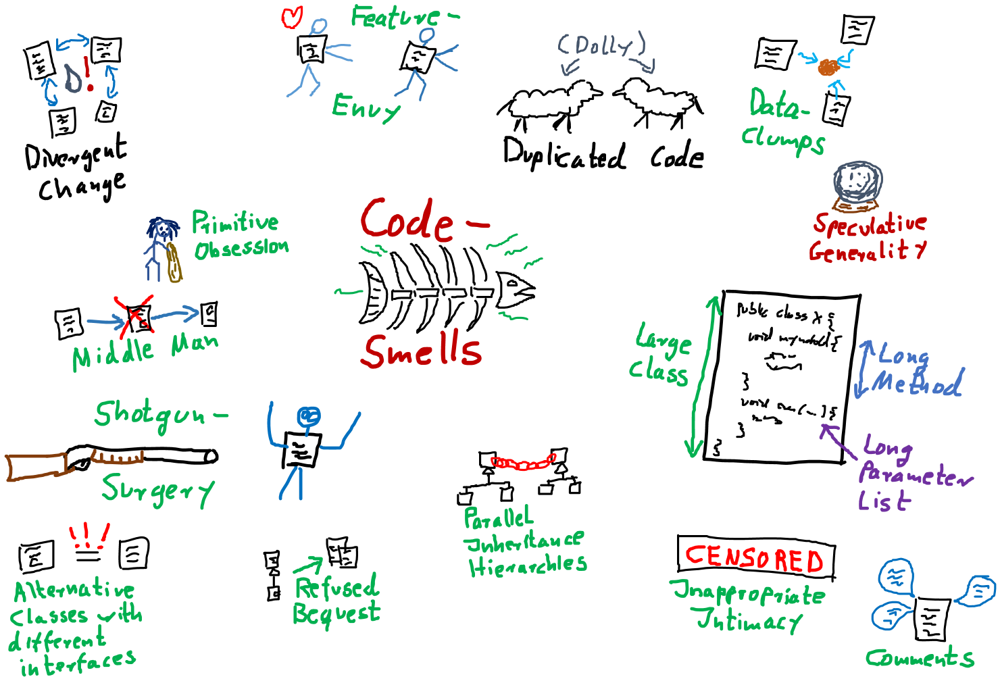
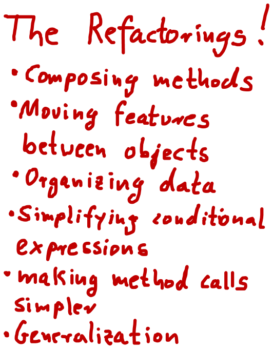
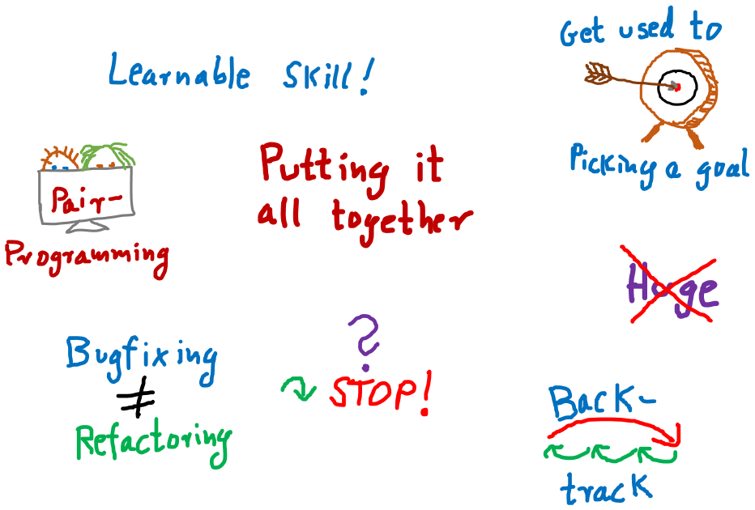

# Refactoring

## Book "Refactoring" by Martin Fowler
- one of __the__ sources for the topic
- "Refactoring is the process of changing a software system in such a way that it does not alter the external behavior of the code yet improves its internal structure. It is a disciplined way to clean up code that minimizes the chances of introducing bugs. In essence when you refactor you are improving the design of the code after it has been written."
- book written in 1999, when agile methods have not become that popular. Hence: improving existing code step by step new thing
- today: Refactoring = fundamental skill of every developer + part of many methods, such as TDD ("Red - Green - Refactor")
- Refactoring = part of developer's everyday life: first refactor, then add new functionality
- also: refactoring steps in book described in detail what today's IDEs can do automated. Some errors author made are impossible to do now, except when ignoring capabilities of IDEs and doing everything by hand.
 
## Simple Refactorings in Chapter 1

- _hint for speaker_: 
    - _show refactoring step by step by first having a look at the result and then executing the refactoring._ 
    - _Use this opportunity to show shortcuts and IDE functionality._
    - _Later refactorings can become complicated. Maybe just showing diff-view is enough => explain diff-view!_
- Following examples from the book plus [tobyweston/Refactoring-Chapter-1](https://github.com/tobyweston/Refactoring-Chapter-1) (attention: some minor naming and syntax changes in comparison to the book)
- each commit is a refactoring from the book
- first step of refactoring: add a solid test base, for example via behavior tests (record given behavior of a method / class without thinking about what it really should do too much) - not done in the book however

### Refactoring: extract method
- switch-statement in class Customer ugly
- done with modern IDE: method gets extracted without problems with two parameters rental and amount
- because amount is set to 0 in for-loop, change it to return parameter 
- [extract method](https://github.com/tobyweston/Refactoring-Chapter-1/commit/8e249c8954d92aebabf304d875ac6f597977b307)

### Refactoring: Renaming
- not covered in Github-repo. However, extracted method above is propsed as "getAmount" by IDE. Rename it to "amountFor(Rental)".
- renaming = one of the 
    - most basic refactorings; very easy to do while just reading the code
    - hardest things to do in software development; always take your time to find a great name
 - very important to do with IDE support, even when just renaming a variable used a few lines below - errors will creep in!
- also: __don't__ rename using search + replace all. Use proper IDE functionality.
- antipatterns (especially in Java):
    - XYManager
    - XYUtil
    - XYHelper

### Refactoring: Move Method
- new method amountFor in Customer uses information from Rental, but not from Customer = encapsulation error
- IntelliJ IDEA proposes class Rental intelligently when "move method" refactoring is called. Also, parameter is removed because method was moved into the parameter. 
- [move method](https://github.com/tobyweston/Refactoring-Chapter-1/commit/15c340ea73ac30b6fb41f607e6328ec48b87e849)

### Refactoring: Replace Temporary Variables with Query
- [Replace Temp with Query](https://github.com/tobyweston/Refactoring-Chapter-1/commit/98a38bcdb9b6eba987a31c939e5d04a9d13ad3de)

### Refactoring: extract method 
- [Extract method to isolate frequent renter points](https://github.com/tobyweston/Refactoring-Chapter-1/commit/74b34ba9ae870c6d5e4a5d0b8538dda043b77846)
- resulting method bad name: no getter!
- extracted method ugly, can be simplified. However: when refactoring, go step by step!
- simplification done in the [next step](https://github.com/tobyweston/Refactoring-Chapter-1/commit/8f9b81021aa71caf6f48c837e56eb135258a2d5f)

### Refactoring: replace temp with query
- [first step](https://github.com/tobyweston/Refactoring-Chapter-1/commit/9f57c1cea43af7742e76945c27535c1ab01437bc), [second step](https://github.com/tobyweston/Refactoring-Chapter-1/commit/a90a5ff957fb9064cd01377a1fcdb59866f0abda)
- possible issues with this refactoring:
    1. adds code => but improves readability. Always a good trade!
    1. goes through loop multiple times instead of just one time, so possible performance issue => don't optimize until profiled and proofed that this is really slow!

### Refactoring: extract and move methods to create consistent classes
- goal: less calls to other classes in calculations == move methods to where they belong
- [first step](https://github.com/tobyweston/Refactoring-Chapter-1/commit/69859dd14a232e00264afef3caa396988f0873cf)
- [second step](https://github.com/tobyweston/Refactoring-Chapter-1/commit/e69a71e29b7e1d556afd932c9264479a37c1a80f)     

### Refactoring: Introduce inheritance
- each type of movie (regular, children's, new release) has different price that is computed in Movie.getCharge()
- can be solved with subclasses: (new) classes RegularMovie, ChildrensMovie, NewReleaseMovie all extend class Movie
- BAD IDEA: movies will switch from NewReleaseMovie to some other category
- alternative: (new) classes RegularPrice, ChildrensPrice, NewReleasePrice all extend Price, which is used by Movie. That way, category of movie can be changed by simply switching to a new price.

  
- [create new price classes](https://github.com/tobyweston/Refactoring-Chapter-1/commit/a0d35118b90c8a2ec2a4dd601d2dd73f9ae727ad)
- [use new inheritance in calculation](https://github.com/tobyweston/Refactoring-Chapter-1/commit/c6e70880eae6c0867044b60e016ee0277fafcf8d)
- replace condition with inheritance: [1](https://github.com/tobyweston/Refactoring-Chapter-1/commit/4511529ce748aae80ee1cf2896bc581b991271a8), [2](https://github.com/tobyweston/Refactoring-Chapter-1/commit/445fd49c955d977f5225b8a0f6bfc48cbfd1c8c4)
- change can be viewed as a [state pattern](https://en.wikipedia.org/wiki/State_pattern) or a [strategy pattern](https://en.wikipedia.org/wiki/Strategy_pattern)

## Chapter 2: Principles in Refactoring
 

### refactor, don't fix!
- refactoring != adding functions. You should be aware of which of these you are doing right now.
- resist temptation to do both refactoring and changing functionality in one step
- when encountering an error, create defect for future fixing

### Refactor to readability
- most important aspect of code: should be readable because it gets read much more than it gets written
- also, refactoring can help understand unfamiliar code. Kind of "active reading".

### Refactoring = investment
- refactoring helps writing good code more quickly - on the long run! In the short run, it takes more time.
- Don't plan a "refactoring sprint", but refactor after every couple of commits, all the time!
- Refactoring code from others doesn't mean they are not able to write great code, just that you see things differently and can improve the code because of this outsiders position.
- hard decision: tell or don't tell the customer about refactoring issues? Depends.

### Keep environment in mind
- limitations to refactoring: refactoring already published interfaces will cause problems in code you can't reach. Especially important in framework- and toolkit-code. Can happen with simple refactorings like change method name. Solution: Keep old interface around for a while, mark it with @Deprecated (with a short explanation!). Don't copy method body, but let old implementation call the new one.
- refactoring and design: instead of big upfront-design, design thoughts should be made to a specific degree (upfront), but the rest should be done via refactoring. Do not find __the__ design solution, but __a__ reasonable one.

### No premature optimization
- very interesting story on page 58/59: about speculation in optimization of systems: "The lesson is: Even if you know exactly what is going on in your system, measure performance, don't speculate. You'll learn something, and nine times out of ten, it won't be that you were right!"     

## Chapter 3: Bad smells in code

- "bad smell" = code that somehow got bad over time in one aspect or another
- no precise criteria, informed human intuition is still the best

### Duplicated Code
- most often simply solved by extract method
- in inheritance hierarchies: extract method + move method to parent => dangerous, may break inheritance!
- duplication in two completely unrelated classes: extract class => may be time to write a static final util-class with pure functions!

### Long method
- short methods often confusing - "Where are things done? I only see delegations to delegations ...". However, on the long run, short methods better.
- "If you have a good name for a method you don't need to look at the body"
- metric: "whenever we feel the need to comment something, we write a method instead"
- OK if resulting code longer than before
- signs for extractions:
    - blocks of code that have comments
    - for-loops
    
### Large Class
- many instance variables, long methods, many methods
- solutions:
    - extract class / subclass (be careful to build a "real" inheritance structure!). Decide new structure by having a look how the class is used by its customers.
    - (if existing) reduce duplications

### Long parameter list
- inconsistent and difficult to use
- parameter objects can encapsulate a number of arguments, so that there are fewer arguments which are queried to get the relevant data

### Divergent Change
- occurs when one class or method changes often for different reasons
- solution: separate concerns by creating new classes (refactoring "extract to class")

### Shotgun Surgery
- to implement a change request, necessary to change a lot of files with only very small changes
- similar to divergent change, but opposite: divergent change = one class, many changes. Shotgun surgery = multiple classes, small changes
- solution: move method, move field

### Feature Envy
-  = class more interested in another class than it should be = a lot of getter-calls (or similar)
- move method to the place the method really wants to be

### Data Clumps
- = data items that hang together all the time while being implemented in separate classes
- solution: extract class to hold rogue data items + introduce parameter object
- quick win: parameter lists shrink

### Primitive Obsession
- don't use primitives where value objects can be used
- especially small objects like ZIP codes or telephone numbers

### Parallel Inheritance Hierarchies
- creating subclasses of one class forces creation of subclasses of another type
- solution: use move method and move field to get rid of dependency between the two hierarchies

### Speculative Generality
- adding hooks and special cases to handle possible future requirements that may never be implemented
- make code hard to understand and change

### Middle Man
- = classes that have very similar interfaces to the classes they refer calls to
- solution: remove middle man

### Inappropriate Intimacy
- = several classes doing too much with each other
- solution: move method and field, change bidirectional association to unidirectional, extract class

### Alternative Classes with Different Interfaces
- = classes doing the same thing but with different interfaces
- solution: move method, extract superclass

### Refused Bequest
- = subclasses that don't use all methods from parent class
- solution: Replace Inheritance with Delegation
- in general: favor composition over inheritance!

### Comments
- for itself not a bad smell, but indicators for such
- solutions: remove real bad smell, then remove comments because they aren't needed anymore  

## Chapter 6: Composing methods

- _hint for speaker: Show examples from the book. Some of them easy to do in modern IDEs, if that's the case, show that._
- main problem: too long methods
- solution: extract method
- assigning to parameters always bad idea

### Extract method
- code fragment that can be grouped together => Turn into a method with proper name
- increased chance that other methods can use the new, shorter method
- higher-level methods will look like series of comments
- dealing with variables main source of work. Solutions: adding return values, using parameters

### Inline method
- methods body easy enough to understand => remove method + put body in callers
- before inlining, check if method isn't polymorphic, i.e. that no class overrides it

### Inline temp 
- = remove temporal variable with actual call to method
- first, declare temp final to check for other assignments

### Replace temp with query
- replace temporal variable with call to method, created with the expression of the temp
- important step towards extract method
- first, declare temp final to check for other assignments

### Introduce explaining variable
- extract parts of complicated expression in variable
- variable is only visible in current scope. To broaden scope, use extract method.

### Split temporary variable
- one variable that is not a loop variable gets assigned multiple times => create separate temp variable for each assignment
-  multiple assignment = sign for more than one responsibility

### Remove assignments to parameters
- assignments to parameters should be replaced by assignments to temporary variables
- if parameters are objects, these objects change outside of the scope of the method => leads to error-prone and hard to understand code
- important step towards pure functions 
#### Pass by value in Java
(following example taken from the book _Refactoring_)

    class Param {
        public static void main(String[] args) {
            int x = 5;
            triple(x);
            System.out.println ("x after triple: " + x);
        }
        
        private static void triple(int arg) {
            arg = arg * 3;
            System.out.println ("arg in triple: " + arg);
        }
    } 
- result:
    - arg in triple: 15
    - x after triple: 5
    
    
    class Param {
        public static void main(String[] args) {
            Date d1 = new Date ("1 Apr 98");
            nextDateUpdate(d1);
            System.out.println ("d1 after nextDay: " + d1);
            Date d2 = new Date ("1 Apr 98");
            nextDateReplace(d2);
            System.out.println ("d2 after nextDay: " + d2);
        }
        private static void nextDateUpdate (Date arg) {
            arg.setDate(arg.getDate() + 1);
            System.out.println ("arg in nextDay: " + arg);
        }
        private static void nextDateReplace (Date arg) {
            arg = new Date (arg.getYear(), arg.getMonth(), arg.getDate() + 1);
            System.out.println ("arg in nextDay: " + arg);
        }
    }
- result:
    - arg in nextDay: Thu Apr 02 00:00:00 EST 1998
    - d1 after nextDay: Thu Apr 02 00:00:00 EST 1998
    - arg in nextDay: Thu Apr 02 00:00:00 EST 1998
    - d2 after nextDay: Wed Apr 01 00:00:00 EST 1998

__Java always uses call-by-value. Objects however are call by reference.__

### Replace method with method object
- long method using local variables so that extract method is not possible => extract object for method where local variables become fields
- first step of further refactorings within the new class

## Chapter 7: Moving features between objects
- "Where to put responsibilities?" important question

### Move method
- when classes are too big or to high coupling between classes
- important: keep an eye to polymorphism

### Move field
- when fields are used more by other classes than the ones which they are defined in

### Extract class
- when class has too much tasks, move fields and methods to new class
- often necessary after some time, when classes grew too big
- goal: every class __one__ responsibility

### Inline class
- when a class is "too small", move its features to another class and delete it
- Attention: In a world with Domain Driven Design, this refactoring should have good reasons. Often, many small objects that represent an entity are better than few objects that represent many "things". Also, having classes for "small things" increases refactorability because of type-safety.

### Hide delegate
- class _Client_ is calling class _Server_ and _Delegate_. Refactor so that _Client_ only calls _Server_ which then calls _Delegate_. That way, _Client_ doesn't need to know about _Delegate_.
- important key to object orientation: encapsulation = classes need to know less of a system
- in code:

    manager = john.getDepartment().getManager();

to

    public Person getManager() {
        return _department.getManager();
    }
    
    ...
    
    john.getManager();

### Remove middle man
- when class with too much simple delegations, remove delegations and call directly

### Introduce foreign method
- when unmodifiable class needs additional method, create this method in a client class that can access the server class
- code:

    Date newStart = new Date (previousEnd.getYear(), previousEnd.getMonth(), previousEnd.getDate() + 1);

to

    Date newStart = nextDay(previousEnd);
    
    private static Date nextDay(Date arg) {
        return new Date (arg.getYear(),arg.getMonth(), arg.getDate() + 1);
    }

### Introduce local extension
- when unmodifiable class needs several additional methods, add foreign methods to new class
- = "foreign methods times x", but in a new class
- either subclassing or wrapping unmodifiable class

## Chapter 8: Organizing Data
### Self encapsulate field
- when direct access to a field is to be avoided, only use getter and setter to access field
- general discussion between "classes may access their fields directly" vw "every access must happen through accessor-methods"

### Replace data value with object
- when existing data item needs additional data or behavior, turn it into an object
- early in development: simple facts represented as simple data items, often as String. Later extension of these into objects with more attributes

### Change value object to reference object
- often, objects can be divided in value objects (money, time) and reference objects (customer, contract)
- example: order has customer, coded as String. Hence, there are multiple customer-objects that are the same person. If that is to be changed, a new object _Customer_ has to be created. 

### Change reference object to value object
- same as above, just the other way around
- value objects are easier to work with
- value objects should be immutable

### Duplicate observed data
- when data only available in GUI component, create model class that represents data and is synchronised with GUI component. If GUI framework doesn't support model objects, duplicate data and synchronise them.
- today known as model
- in JavaFX: binding instead of Observer

### Change unidirectional association to bidirectional
- given two classes with an unidirectional association that doesn't support new need to navigate from both classes to the other one, add reference
- attention: this is a cyclic dependency!
- generally use bidirectional associations only when needed

### Change bidirectional association with unidirectional
- same as above, just other way around

### Replace magic number with symbolic constant
- replace literal number with new constant with meaningful name
- for example replace _9.81_ with _GRAVITATIONAL_CONSTANT_

### Encapsulate field
- make public field private and provide accessors
- first step towards objects that encapsulate knowledge with methods that use the attributes of this object

### Encapsulate collection
- make method that returns a collection return a read-only view + provide add/remove-methods
- enforces hiding of implementation details and gives class power over how collection is used

### Replace record with data class
- "record" = database record or data structure from legacy system
- convert record into (dumb) data class

### Replace type code with class
- example: _Person_ having a _bloodGroup_ (int) that encodes the real blood groups (0, A, B, AB). Should be refactored to enum _BloodGroup_ + _Person_ should use this new enum

### Replace type code with subclasses
- same as above, just with inheritance
- example: _Employee_ having a _type_ of int, showing if this _Employee_ is either an _Engineer_ or a _Salesman_. Solution: Create inheritance, so the type of the _Employee_ is shown in its object type.

### Replace type code with state / strategy
- same example as above, other solution: replace code with state object: _Employee_ has reference to (new) _EmployeeType_, with is (via polymorphism) either an _Engineer_ or a _Salesman_

### Replace subclass with fields
- existing subclasses vary only in methods that return constant data => remove subclasses, replace them with fields 

## Chapter 9: Simplifying conditional expressions
- make complicated if-then-else easier to read

### Decompose Conditional
- in complicated conditional, extract methods from if-, then- and else-part
- thereby highlighting the conditional and separating "why" from "how"
- supports "same level of abstraction in one method"

### Consolidate Conditional Expression
- combine sequence of conditional tests with same result into one test

    double disabilityAmount() {
        if (_seniority < 2) return 0;
        if (_monthsDisabled > 12) return 0;
        if (_isPartTime) return 0;
        // compute the disability amount
        
     to
        
     double disabilityAmount() {
        if (isNotEligableForDisability()) return 0;
        // compute the disability amount

### Consolidate duplicate conditional fragments
- move code that is in all branches of conditional expression outside of conditional
- also valid for exceptions

### Remove control flag
- Use break or return instead of boolean control flag
- example: _while_ using a variable which is set to _false_ in the loop. This can be replaced by return.
- "one entry point, one exit point" from old rules of structured programming, don't necessarily apply anymore

### Replace nested conditional with guard clauses
- when complex conditional behavior obscures normal path of execution, insert _if - return_ for exceptional behavior and a "normal" return for normal behavior.

### Replace conditional with polymorphism
- remove conditional with different behavior, depending on type of object, in favor of polymorphism
- one fundamental promise of polymorphism: avoid writing explicit conditional when object behavior varies depending on types
- each object overwrites method (or doesn't if default implementation is sufficient)

### Introduce null object
- replace null checks with null object
- create object that represents a neutral null state
- use object like other, "real" objects
- null objects never change, hence implement via Singleton

### Introduce assertion
- basically, use _Assert.isTrue()_ for parts of the code that assume things

## Chapter 10: Making method calls simpler
- interfaces (as in APIs) = key skill

### Rename Method
- rename method so its name reveals its purpose

### Add / Remove Parameter => nothing special about it

### Separate Query from modifier
- method that changes state of an object __and__ return an object should be separated into two methods
- step towards pure functions because query-part of method gets moved to own method

### Parameterize method
- several methods doing nearly the same thing could be merged into one, parameterized method
- example: _fivePercentRaise()_ + _tenPercentRaise()_ = _raise(percentage)_

### Replace parameter with explicit methods
- opposite of above

### Preserve whole object
- method calls that take multiple attributes from the same object could take the whole object instead
- upside: method could use other attributes of passed object without changing its signature
- downside: new dependency on object instead of just its fields   
- alternative approach: move method to object that provides the attributes used by the method (if that makes sense)

### Replace parameter with method
- instead of passing the result from a method call to a method, let that method call the other method itself
- upside: shorter parameter list with same functionality

### Introduce parameter object
- encapsulate multiple parameters into a parameter object, if they belong together
- great example: _startDate_ + _endDate_ = _DateRange_
- single classes = "data clump" that should explicitly be defined, for example with a new object
- further benefit: behavior regarding the common attributes can be moved into the new object, creating _one_ place for the defined behavior and the necessary data

### Remove setting method
- remove setter if attribute shouldn't be altered after creation time
- good idea: additionally, declare field _final_

### Hide method
- generally: apply encapsulation and use most restrictive access modifier

### Replace constructor with factory method
- if more than simple construction is done in a constructor, it should be replaced with a factory method

### Encapsulate downcast
- basically: "Use the right types!"
- chapter became obsolete with introduction of generics

### Replace error code with exception
- use exceptions instead of error codes
- chapter also obsolete; haven't seen error codes in years (and only then from a ... saisoned developer)

### Replace exception with test
- let calling method check for a condition instead of having the called method throw an exception

  
## Chapter 11: Dealing with generalization
- bunch of refactorings concerning inheritance

### pull up field / method
- if all subclasses have same fields / methods, move them to superclass
- attention: this may break Liskov Substitution Principle!

### Push down field / method
- opposite from above

### Extract subclass / superclass
- move features used only in some instances to a new sub- / superclass
- own opinion: bad refactoring because inheritance is not meant to be used for moving features and behaviors around, see Liskov Substitution Principle
  
### extract interface
- explicitly declare subset of a class' responsibility to interface to be used by other classes

### Collapse hierarchy
- merge super- and subclasses, that don't have much differences, together into one class

### Form template method
- given an inheritance hierarchy, if several methods perform the same steps with slightly different implementation, extract a template method for the algorithm and let subclasses provide methods for their special behavior

### Replace inheritance with delegation
- if subclass uses only part of superclasses interface or doesn't inherit data, remove inheritance and add delegation to former superclass

### Replace delegation with inheritance
- opposite from above
- again, adding inheritance may break Liskov Substitution Principle 

## Chapter 12: Big refactorings

- simple refactorings shown before are just single steps of way larger refactorings 
- refactorings take time! "Months or years"
- big refactorings often in parallel to day-to-day work like adding features, because total stop of development to finish all refactorings not possible
- "making the world a little safer for your program every day"
- also, big refactorings need agreement and commitment by whole development team -> communication is key!
- finish bigger refactorings, don't let them stay half-finished

### tease apart inheritance
- inheritance hierarchy doing two jobs at once is better divided into two separate hierarchies, using delegation to call each other
- example:
    - _Deal_ as superclass has _ActiveDeal_ and _PassiveDeal_ as subclasses
    - _ActiveDeal_ has _TabularActiveDeal_ ans subclass, _PassiveDeal_ has _TabularPassiveDeal_ as subclass
    - two concerns merged into one hierarchy: 
        - business logic: There are two forms of deals
        - presentation style: There are two styles (tabular and single)
    - solution: two hierarchies, one for business logic, one for presentation
 
### Convert procedural design to objects
- code written in a procedural style should be refactored to be using objects
- example:
    - _OrderCalculator_ with methods _determinePrice(Order)_ and _determineTaxes(Order)_ uses Objects _Order_ and _OrderLine_, but in a procedural way
    - better solution: move methods to _Order_ and _OrderLine_ because that's where they belong to
- often result of outdated coding style

### Separate domain from presentation
- GUI classes with domain logic should be refactored so the logic stays in a separate layer
- example not cited because that's pretty easy to understand

### Extract hierarchy
- overloaded class with many conditional statements should be refactored into hierarchy where subclasses represent special cases
- example: single class _BillingScheme_ should be superclass of hierarchy with _BusinessBillingScheme_, _RedientialBilingScheme_ and _DisabilityBillingScheme_ as subclasses

## Chapter 15: Putting it all together

- refactoring = learnable skill

### get used to picking a goal
- find what makes your code easier to read and understand and march towards that exact goal

### stop when you are unsure
- if changes may break existing functionality or goal already reached, stop!
 
### backtrack
- when refactoring, force yourself to run tests after each step
- if tests haven't been run and error occurs: backtrack to find exact change that caused the error

### Duets / Pair Programming
- self-explanatory

### Nibble on problem instead of huge refactoring
- huge refactorings cause more problems
- small changes, brought fast to production, will make errors visible faster

### Don't mix bugfixing and refactoring
- even when wrong behavior of code obvious when refactoring, don't fix it
- create defect for later
- leave functionality of code the same for now

## Sources
- Refactoring - Improving the design of existing code. Martin Fowler, Kent Beck